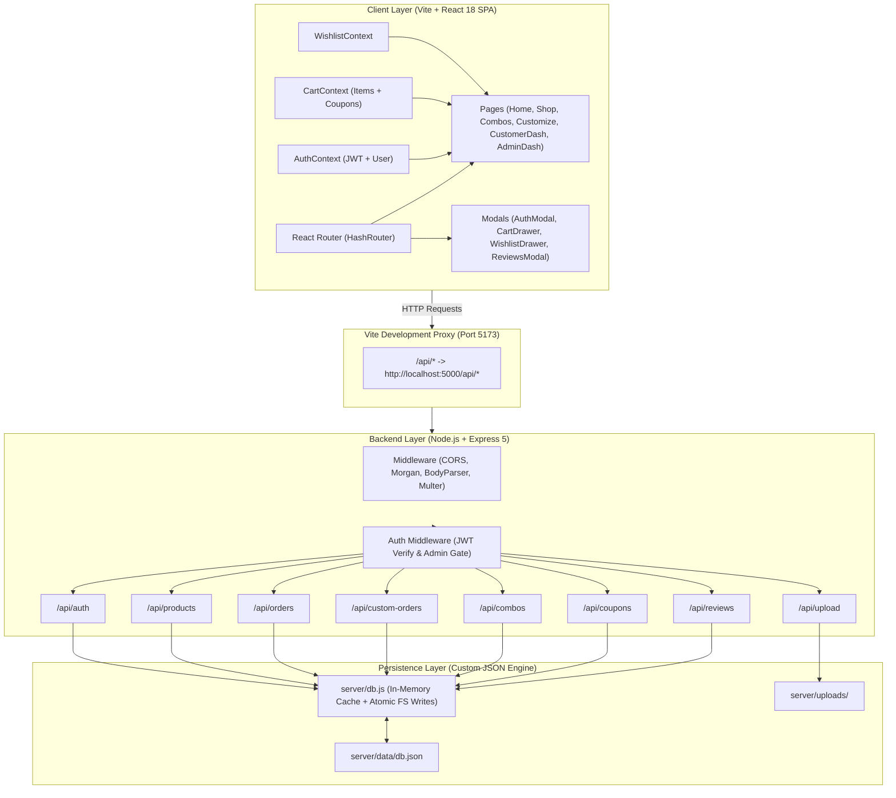
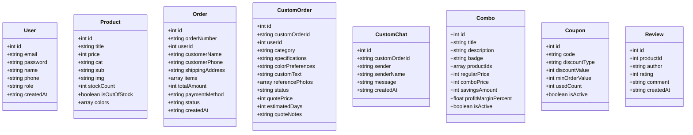

# handii.co — Comprehensive Technical Architecture & Deep-Dive Manual

> **A Complete, File-by-File, Function-by-Function Engineering Specification for the handii.co Handmade Factory E-Commerce Platform.**

---

## 📑 Detailed Table of Contents

1. [High-Level System Architecture](#1-high-level-system-architecture)
2. [Root Configuration & Dependencies](#2-root-configuration--dependencies)
   - `package.json` — All packages and reasons for selection
   - `vite.config.js` & `index.html` — Build environment, proxy, fonts, meta
3. [Frontend Engineering Deep-Dive](#3-frontend-engineering-deep-dive)
   - `src/main.jsx` & `src/App.jsx`
   - Global Context State (`AuthContext.jsx`, `CartContext.jsx`, `WishlistContext.jsx`)
   - Page Views (`HomePage.jsx`, `ShopPage.jsx`, `CombosPage.jsx`, `CustomizePage.jsx`, `CustomerDashboardPage.jsx`, `AdminDashboardPage.jsx`)
   - Component Layer (Header, Footer, Drawers, Modals, Cards, 3D Canvas, Reviews)
   - Design System & Tokens (`src/index.css`)
4. [Backend Engineering Deep-Dive](#4-backend-engineering-deep-dive)
   - `server/index.js` — Server bootstrap, middleware pipeline & port binding
   - `server/db.js` — Custom JSON Database Engine with in-memory caching
   - `server/seed.js` — Database seeding & initialization
   - Middleware Layer (`server/middleware/auth.js`)
   - API Routes (`auth.js`, `products.js`, `orders.js`, `customOrders.js`, `combos.js`, `coupons.js`, `reviews.js`, `reels.js`, `upload.js`)
5. [Cross-Cutting Technical Workflows](#5-cross-cutting-technical-workflows)
   - Margin Safeguard Algorithm
   - Coupon Discount Calculation Engine
   - 1-on-1 Bespoke Quoting & DM Messaging Lifecycle
   - Live Stock & Out-of-Stock Management
6. [Data Dictionary & Schema Specifications](#6-data-dictionary--schema-specifications)
7. [Operational & Developer Cheatsheet](#7-operational--developer-cheatsheet)

---

## 1. High-Level System Architecture



---

## 2. Root Configuration & Dependencies

### `package.json`

```json
{
  "name": "handii-co",
  "private": true,
  "version": "1.0.0",
  "type": "module",
  "scripts": {
    "dev": "concurrently -n \"server,client\" -c \"magenta,cyan\" \"npm run server\" \"npm run client\"",
    "server": "node server/index.js",
    "client": "vite",
    "build": "vite build",
    "preview": "vite preview"
  }
}
```

#### Detailed Dependency Breakdown

| Package | Version | Layer | Why It Is Used |
|---|---|---|---|
| `react` | `^18.3.1` | Frontend | Core component lifecycle, hooks (`useState`, `useEffect`, `useContext`, `useRef`), and virtual DOM rendering. |
| `react-dom` | `^18.3.1` | Frontend | DOM rendering engine for React in the browser. |
| `react-router-dom`| `^7.18.3` | Frontend | Client-side routing (`HashRouter`, `Routes`, `Route`, `Link`, `NavLink`, `useNavigate`, `useSearchParams`). |
| `express` | `^5.2.1` | Backend | High-speed REST API web framework providing routing, request handling, and middleware integration. |
| `jsonwebtoken` | `^9.0.3` | Backend | Generates and verifies HMAC SHA256 signed JSON Web Tokens (JWT) for stateless user and admin authentication. |
| `bcryptjs` | `^3.0.3` | Backend | One-way salted hashing algorithm to securely store passwords without plaintext exposure. |
| `multer` | `^2.3.0` | Backend | Multipart `multipart/form-data` parser for handling reference photo uploads from the custom order studio. |
| `cors` | `^2.8.6` | Backend | Cross-Origin Resource Sharing middleware enabling secure API requests between frontend dev server (5173) and backend API (5000). |
| `morgan` | `^1.12.0` | Backend | HTTP request logger middleware for terminal debugging. |
| `concurrently` | `^10.0.5` | Dev Tool | Spawns and streams both the Express backend and Vite frontend simultaneously via a single `npm run dev` command. |
| `vite` | `^5.4.0` | Dev Tool | Next-generation frontend build tool and dev server featuring native ES modules and near-instant Hot Module Replacement (HMR). |
| `@vitejs/plugin-react` | `^4.3.1` | Dev Tool | Official Vite plugin enabling Fast Refresh for React components. |

---

## 3. Frontend Engineering Deep-Dive

### Root Entry & Application Orchestrator

#### 1. `src/main.jsx`
- **Purpose:** Entry point for the browser bundle.
- **Functions:**
  - Mounts `<App />` into the DOM element `#root` via `createRoot`.
  - Imports `index.css` globally.

#### 2. `src/App.jsx`
- **Purpose:** Master layout coordinator, provider hierarchy, and route switchboard.
- **Key State / Hooks:**
  - `activeReviewProduct`: Holds the product object when a user opens the reviews modal.
  - `isCartOpen`, `isWishlistOpen`, `authModalOpen`, `authMode`: UI drawer/modal visibility states.
- **Provider Hierarchy:**
  ```jsx
  <HashRouter>
    <AuthProvider>
      <WishlistProvider>
        <CartProvider>
          <Header />
          <Routes>...</Routes>
          <DrawersAndModals />
          <Footer />
        </CartProvider>
      </WishlistProvider>
    </AuthProvider>
  </HashRouter>
  ```
- **Active Routes:**
  - `/` → `<HomePage />`
  - `/shop` → `<ShopPage />`
  - `/combos` → `<CombosPage />`
  - `/customize` → `<CustomizePage />`
  - `/dashboard` → `<CustomerDashboardPage />`
  - `/admin` → `<AdminDashboardPage />`

---

### Global Context Layer (`src/context/`)

#### 1. `AuthContext.jsx`
- **Purpose:** Centralized user session, admin role verification, and token storage.
- **Exported Values & Functions:**
  - `user`: Current authenticated user object `{ id, name, email, phone, role }`.
  - `token`: Active JWT string.
  - `isAdmin`: Boolean flag (`user?.role === 'admin'`).
  - `login(email, password)`: Sends `POST /api/auth/login`, persists JWT in `localStorage`, and updates `user`.
  - `register(name, email, phone, password)`: Sends `POST /api/auth/register`, stores JWT, and auto-logs in.
  - `logout()`: Clears `localStorage` (`handii_token`, `handii_user`), resets state to `null`.
  - `openAuthModal(mode)` / `closeAuthModal()`: Controls auth dialog visibility.

#### 2. `CartContext.jsx`
- **Purpose:** Manages shopping cart contents, line items, quantities, and coupon discount validation.
- **Exported Values & Functions:**
  - `cart`: Array of items `[{ id, title, price, img, quantity, color, customText }]`.
  - `appliedCoupon`: Active coupon discount object `{ code, discountType, discountValue, discountAmount }`.
  - `addToCart(product, quantity, options)`: Adds or increments product quantity; shows notification.
  - `removeFromCart(index)`: Removes a specific line item.
  - `updateQuantity(index, newQty)`: Updates quantity (removes if `newQty <= 0`).
  - `clearCart()`: Empties the cart upon checkout.
  - `applyCoupon(couponCode)`: Calls `POST /api/coupons/validate` with current subtotal and applies calculated discount.
  - `removeCoupon()`: Detaches active coupon.
  - `subtotal`: Sum of all line item prices.
  - `total`: `Math.max(0, subtotal - discountAmount)`.

#### 3. `WishlistContext.jsx`
- **Purpose:** Manages customer wishlist items with `localStorage` persistence.
- **Exported Values & Functions:**
  - `wishlist`: Array of saved product objects.
  - `toggleWishlist(product)`: Adds if absent, removes if already present.
  - `isInWishlist(productId)`: Helper function returning boolean.

---

### Multi-Page Views (`src/pages/`)

#### 1. `HomePage.jsx`
- **Purpose:** High-conversion storefront landing page.
- **Composed Subcomponents:**
  - `<Hero />`: Animated headline, call-to-actions, and paper-sticker collage.
  - `<CategoryGrid />`: Visual category entry points (Flowers, Resin, Bracelets, Pixel Art).
  - `<ComboSection />`: Spotlight section showcasing top curated gift bundles.
  - `<Shop previewMode={true} />`: Displays top 8 trending catalog pieces.
  - `<Reels />`: Social video showcases of the crafting process.
  - `<About />`: Handcrafted brand narrative.
  - `<Contact />`: Restock email signup form.

#### 2. `ShopPage.jsx`
- **Purpose:** Full filterable and searchable catalog view.
- **Key Features & State:**
  - `catFilter`, `subFilter`: Category and subcategory filtering (`pipecleaner`, `resin`, `bracelets`, `pixelart`).
  - `searchQuery`: Live text search matching product titles.
  - URL query synchronization: Listens to `?cat=resin&sub=coasters` via `useSearchParams`.
  - Real-time stock badge rendering: Displays `Out of Stock` overlay if `isOutOfStock` or `stockCount === 0`.
  - Product Card review launcher: Opens the `<ProductReviewsModal />`.

#### 3. `CombosPage.jsx`
- **Purpose:** Dedicated curated bundles storefront.
- **Key Features & State:**
  - Fetches active bundles from `GET /api/combos`.
  - Detailed bundle cards displaying included product thumbnails, regular price strikethrough, deal price, and savings pill.
  - "Add Bundle to Cart 🎁" button: Adds the bundle as a single discounted line item.

#### 4. `CustomizePage.jsx`
- **Purpose:** Interactive customization suite with two distinct modes.
- **Mode 1: 3D Bag & Keychain Customizer:**
  - Renders `<Customizer3D />` (Three.js WebGL canvas).
  - Controls: Leather tone selector, letter charm alphabet input, flower charm attachments.
  - Calculates custom price dynamically and adds custom config to the cart.
- **Mode 2: 1-on-1 Bespoke Artisan Studio & DM Inquiries:**
  - Multipart upload form: Customer uploads reference photos (`FormData` to `POST /api/upload`) and submits specs (`POST /api/custom-orders`).
  - Real-time Chat Thread: Customer and artisan exchange messages with timestamps and role badges.
  - Quote acceptance flow: Displays official artisan quote (`quotePrice`, `estimatedDays`, `quoteNotes`) with "Accept Quote & Pay" button.

#### 5. `CustomerDashboardPage.jsx`
- **Purpose:** User account hub for order tracking, custom quote tracking, and wishlist management.
- **Tabs:**
  - **Orders Tab:** Displays historical orders with step-by-step progress tracking (`Pending` → `Crafting` → `Dispatched` → `Delivered`).
  - **Custom Inquiries Tab:** Lists all bespoke requests submitted by the user with their status and live chat link.
  - **Wishlist Tab:** Grid of saved items with quick "Move to Cart" actions.
  - **Profile Tab:** Shows user contact information and "Sign Out" button.

#### 6. `AdminDashboardPage.jsx`
- **Purpose:** Comprehensive operations management portal for the studio owner.
- **Role Guard:** Automatically verifies `isAdmin === true`. If unauthorized, renders an admin login gateway.
- **Tabs:**
  - **Analytics & KPIs:** Real-time revenue metrics, total orders, pending custom quotes, and out-of-stock item counters.
  - **Orders Management:** Filter orders by status, view shipping addresses, update order progress in real-time, and launch direct WhatsApp customer notifications with pre-filled messages.
  - **Stock & Inventory CMS:** Responsive card grid with 4:5 image thumbnails, stock counts, search, "+ Add Product" modal, and one-click "Mark Out of Stock / Mark In Stock" toggle buttons.
  - **Custom Quotes & DMs:** Two-column messaging studio where admin reviews uploaded customer reference photos, replies in real-time chat, and issues official price quotes (`quotePrice`, `quoteDays`, `quoteNotes`) or declines requests.
  - **Margin-Safe Combo Builder:** Interactive combo creator that analyzes total retail vs cost, calculates profit margin, blocks publishing if margin is below 25%, and provides a **"🗑️ Remove Bundle"** button to delete live combos.
  - **Coupon Manager:** Promo code creator (percentage or fixed discount, minimum spend threshold) and **"🗑️ Delete Coupon"** button.

---

### Component Layer (`src/components/`)

| Component | File | Key Functions & Responsibilities |
|---|---|---|
| **Header** | `Header.jsx` | Navigation bar with `NavLink` items, search trigger, Cart Drawer toggle (with badge counter), Wishlist toggle, and User / Admin dashboard trigger. |
| **Footer** | `Footer.jsx` | Brand story, categorized catalog links, social channels (Instagram, WhatsApp, Pinterest), and copyright. |
| **Hero** | `Hero.jsx` | Hero banner with editorial typography, badge stickers, CTA buttons, and 3-photo rotating collage. |
| **CategoryGrid** | `CategoryGrid.jsx` | 4-card responsive category strip for quick catalog jumping. |
| **ProductCard** | `ProductCard.jsx` | Displays product image, price, title, stock indicator, wishlist heart toggle, "Add to Cart" button, and review rating stars trigger. |
| **ProductReviewsModal** | `ProductReviewsModal.jsx` | Fetches and displays reviews for a product (`GET /api/reviews/:id`) and provides star rating submission form (`POST /api/reviews/:id`). |
| **Customizer3D** | `Customizer3D.jsx` | Three.js WebGL canvas with procedural lighting, rotating bag geometry, letter charm textures, and floral attachments. |
| **CartDrawer** | `CartDrawer.jsx` | Slide-over cart panel with line item quantity adjusters, subtotal calculation, coupon input box, and checkout launcher. |
| **WishlistDrawer** | `WishlistDrawer.jsx` | Slide-over panel for saved items with one-click "Move to Cart". |
| **AuthModal** | `AuthModal.jsx` | Modal dialog for Login and Registration with form validation and error handling. |
| **Reels** | `Reels.jsx` | 4-card video reel preview strip showcasing handmade crafting processes. |
| **About** | `About.jsx` | Brand philosophy narrative with stat badges (100% Handmade, 5+ Crafts, 1:1 Custom). |
| **Contact** | `Contact.jsx` | Newsletter signup banner with email validation. |

---

### Design System & Aesthetics (`src/index.css`)

The application is styled using a handcrafted paper-and-thread design system defined via CSS Custom Properties (`:root`):

```css
:root {
  --cream: #FAF6EE;       /* Warm background base */
  --paper: #FFFDF8;       /* Card and surface background */
  --ink: #1E3A3F;         /* Deep studio teal-black typography */
  --gold: #E3AE49;        /* Warm gold accent */
  --gold-deep: #C98F2C;   /* Deep gold border / hover */
  --rose: #C86D5C;        /* Terracotta rose accent & price tags */
  --sage: #7A9A8B;        /* Earthy green badge accent */
  --line: rgba(30,58,63,0.12); /* Subtle divider lines */
}
```

- **Typography:**
  - Headers: `'Fraunces', serif` (Editorial, high-contrast serif).
  - Handwritten Accents: `'Caveat', cursive` (Artisan handwritten stickers and notes).
  - Body: Modern system sans-serif (`Inter`, system-ui).
- **Interactive Micro-Physics:**
  - Universal `.btn` buttons feature a smooth `transform: translateY(-2px)` lift with soft drop shadow on hover.
  - Image thumbnails feature gentle zoom scales (`transform: scale(1.05)`).
  - Modals and drawers utilize CSS `backdrop-filter: blur(8px)` and smooth slide transitions.

---

## 4. Backend Engineering Deep-Dive

### Server Bootstrap (`server/index.js`)

- **Purpose:** Initializes Express, registers middleware, binds API routes, seeds database, and starts HTTP server on port `5000`.
- **Middleware Pipeline:**
  1. `cors()`: Enables cross-origin requests from the Vite frontend.
  2. `morgan('dev')`: Formats and logs HTTP traffic in terminal.
  3. `express.json()`: Parses JSON request bodies up to 10MB.
  4. `express.urlencoded({ extended: true })`: Parses URL-encoded form data.
  5. `express.static('server/uploads')`: Serves uploaded reference photos statically at `/uploads/*`.
- **Route Bindings:**
  - `app.use('/api/auth', authRoutes)`
  - `app.use('/api/products', productRoutes)`
  - `app.use('/api/orders', orderRoutes)`
  - `app.use('/api/custom-orders', customOrderRoutes)`
  - `app.use('/api/combos', comboRoutes)`
  - `app.use('/api/coupons', couponRoutes)`
  - `app.use('/api/reviews', reviewRoutes)`
  - `app.use('/api/upload', uploadRoutes)`
- **Error Handling Middleware:** Catches unhandled errors and returns structured JSON responses:
  ```json
  { "success": false, "message": "Internal Server Error" }
  ```

---

### Custom Database Engine (`server/db.js`)

The backend uses an in-memory JSON database engine with synchronous disk persistence.

#### Class: `JSONDatabase`

```javascript
class JSONDatabase {
  constructor(filePath) {
    this.filePath = filePath;
    this.data = this.load();
  }
  // Methods:
  getCollection(name)
  find(name, predicate)
  findOne(name, predicate)
  insert(name, doc)
  update(name, predicate, updates)
  delete(name, predicate)
  save()
}
```

#### Method Specifications:

1. **`load()`**: Reads `server/data/db.json` from disk using `fs.readFileSync`. If the file does not exist, initializes an empty schema structure.
2. **`save()`**: Synchronously writes the in-memory `this.data` object back to disk with formatted indentation (`JSON.stringify(this.data, null, 2)`).
3. **`getCollection(collectionName)`**: Returns the array of documents for the given collection (e.g. `'products'`, `'orders'`).
4. **`find(collectionName, predicate)`**: Returns all documents matching the predicate function `(doc) => boolean`. If no predicate is provided, returns all documents.
5. **`findOne(collectionName, predicate)`**: Returns the first document matching the predicate, or `null`.
6. **`insert(collectionName, doc)`**: Generates an auto-incrementing `id` (`Date.now()` or `maxId + 1`), sets `createdAt: new Date().toISOString()`, appends to the collection, executes `save()`, and returns the created document.
7. **`update(collectionName, predicate, updates)`**: Finds all documents matching `predicate`, merges `updates` into each document, updates `updatedAt`, executes `save()`, and returns the updated documents.
8. **`delete(collectionName, predicate)`**: Removes all documents matching `predicate`, executes `save()`, and returns a boolean indicating whether any items were deleted.

---

### Database Seeder (`server/seed.js`)

- **Purpose:** Ensures the database is always pre-populated with master data upon first startup.
- **Seeded Data:**
  - **Admin Account:** `admin@handii.co` (Password: `admin123` hashed with `bcryptjs`, Role: `admin`).
  - **Customer Account:** `customer@handii.co` (Password: `customer123`, Role: `customer`).
  - **Product Catalog:** 14+ initial products (Pipe Cleaner Tulips, Sunflowers, Resin Alphabet Keychains, Botanical Coasters, Beaded Evil Eye Bracelets).
  - **Curated Combos:** Spring Blossom Duo, Botanical Resin Desk Set with pre-calculated margins.
  - **Promo Coupons:** `HANDMADE10` (10% off min ₹399), `FIRSTCRAFT` (₹50 off min ₹299).

---

### Authentication Middleware (`server/middleware/auth.js`)

1. **`requireAuth(req, res, next)`**:
   - Extracts the `Authorization` header (`Bearer <token>`).
   - Verifies the JWT token using `jwt.verify(token, JWT_SECRET)`.
   - Fetches the user from the `users` collection.
   - Attaches `req.user` to the request object and calls `next()`.
   - Returns HTTP 401 if token is missing or invalid.
2. **`requireAdmin(req, res, next)`**:
   - Executes `requireAuth` first.
   - Checks if `req.user.role === 'admin'`.
   - Calls `next()` if admin; returns HTTP 403 Forbidden if not.

---

### API Route Modules (`server/routes/`)

#### 1. `auth.js`
- `POST /api/auth/register` — Validates email uniqueness, hashes password with `bcrypt.hash(password, 10)`, creates user, and signs JWT.
- `POST /api/auth/login` — Verifies password via `bcrypt.compare()`, returns signed JWT token (expires in 7 days).
- `GET /api/auth/me` *(Auth)* — Returns authenticated user profile.

#### 2. `products.js`
- `GET /api/products` — Returns all products with category, stock count, and price.
- `GET /api/products/:id` — Returns single product details.
- `POST /api/products` *(Admin)* — Adds new product to catalog with title, price, category, and image URL.
- `PATCH /api/products/:id/stock` *(Admin)* — Toggles `isOutOfStock` boolean and updates `stockCount`.

#### 3. `orders.js`
- `POST /api/orders` — Receives customer checkout payload, generates unique order number (`#HND-2026-XXXX`), calculates totals, and persists order.
- `GET /api/orders/my-orders` *(Auth)* — Retrieves all orders belonging to `req.user.id`.
- `GET /api/orders/admin/all` *(Admin)* — Retrieves all store orders for fulfillment.
- `PATCH /api/orders/:id/status` *(Admin)* — Updates order status (`pending` → `crafting` → `shipped` → `delivered`).

#### 4. `customOrders.js`
- `POST /api/custom-orders` *(Auth)* — Creates a bespoke order inquiry with custom dimensions, colors, and uploaded reference photo URLs. Generates ID `#CUST-XXXX`.
- `GET /api/custom-orders/my-requests` *(Auth)* — Retrieves user's custom requests.
- `GET /api/custom-orders/admin/all` *(Admin)* — Retrieves all inquiries across the platform.
- `GET /api/custom-orders/:id` *(Auth)* — Retrieves inquiry details and chat history from `custom_chats`.
- `POST /api/custom-orders/:id/messages` *(Auth)* — Appends a new message to the chat thread with sender role tag (`customer` or `admin`).
- `POST /api/custom-orders/:id/quote` *(Admin)* — Updates status to `quoted`, setting `quotePrice`, `estimatedDays`, and `quoteNotes`.
- `POST /api/custom-orders/:id/accept-quote` *(Auth)* — Updates status to `accepted` and moves inquiry into production order pipeline.
- `POST /api/custom-orders/:id/decline` *(Admin)* — Updates status to `declined` with reason note.

#### 5. `combos.js`
- `GET /api/combos` — Returns active published combo bundles.
- `POST /api/combos/calculate-margin` *(Admin)* — Analyzes proposed combo product IDs and proposed price; returns retail value, base cost, profit, and margin percentage.
- `POST /api/combos` *(Admin)* — Validates margin >= 25% and publishes bundle.
- `DELETE /api/combos/:id` *(Admin)* — Deletes published bundle from database and storefront.

#### 6. `coupons.js`
- `POST /api/coupons/validate` — Validates coupon code against minimum cart spend and expiration date; returns calculated discount amount and discounted total.
- `GET /api/coupons` *(Admin)* — Retrieves all promo codes.
- `POST /api/coupons` *(Admin)* — Creates new promo code with percentage or fixed discount rules.
- `DELETE /api/coupons/:id` *(Admin)* — Deletes promo code.

#### 7. `reviews.js`
- `GET /api/reviews/:productId` — Retrieves all user reviews and calculates average star rating for a product.
- `POST /api/reviews/:productId` *(Auth)* — Submits review rating (1-5 stars) and comment text.

#### 8. `upload.js`
- `POST /api/upload` — Uses `multer` disk storage to receive image files (`.jpg`, `.jpeg`, `.png`, `.webp`), saves them to `server/uploads/`, and returns the static URL `/uploads/<filename>`.

---

## 5. Cross-Cutting Technical Workflows

### Margin Safeguard Algorithm

The combo builder prevents loss-making discounts through mathematical margin floor verification:

```javascript
// Margin Guard Calculation Formula:
const totalRetail = selectedProducts.reduce((sum, p) => sum + p.price, 0);
const baseCost = Math.round(totalRetail * 0.45); // Standard 45% production cost
const proposedPrice = parseInt(proposedComboPrice, 10);
const profit = proposedPrice - baseCost;
const profitMarginPercent = Math.round((profit / proposedPrice) * 100);
const minSafePrice = Math.round(baseCost / (1 - 0.25)); // 25% Margin Floor

if (profitMarginPercent < 25) {
  return res.status(400).json({
    success: false,
    message: `Proposed price ₹${proposedPrice} yields ${profitMarginPercent}% margin, which is below the 25% safety floor. Minimum safe price is ₹${minSafePrice}.`
  });
}
```

---

### Coupon Discount Engine

```javascript
// Coupon Discount Resolution:
let discountAmount = 0;
if (coupon.discountType === 'percentage') {
  discountAmount = Math.round((cartSubtotal * coupon.discountValue) / 100);
  if (coupon.maxDiscountCap && discountAmount > coupon.maxDiscountCap) {
    discountAmount = coupon.maxDiscountCap;
  }
} else if (coupon.discountType === 'fixed') {
  discountAmount = Math.min(cartSubtotal, coupon.discountValue);
}
const finalTotal = Math.max(0, cartSubtotal - discountAmount);
```

---

## 6. Data Dictionary & Schema Specifications



---

## 7. Operational & Developer Cheatsheet

### Running the Application

```powershell
# Run both Backend (Port 5000) and Frontend (Port 5173) simultaneously:
npm run dev
```

### Direct Server Commands

```powershell
# Run backend independently:
node server/index.js

# Run frontend independently:
npm run client

# Run a production bundle build:
npm run build
```

### Default Credentials

- **Admin Portal Access:**
  - URL: `http://localhost:5173/#/admin`
  - Email: `admin@handii.co`
  - Password: `admin123`
- **Customer Portal Access:**
  - URL: `http://localhost:5173/#/dashboard`
  - Email: `customer@handii.co`
  - Password: `customer123`

---

*Authored for the handii.co engineering team. All rights reserved.*
